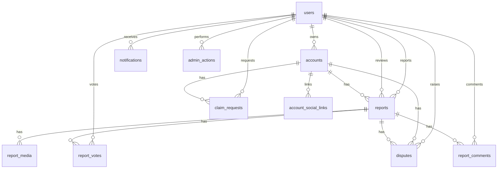

# Shosha V2 MVP Database Design

This document defines the MVP PostgreSQL design for Shosha V2 using SQLAlchemy 2.0 and Alembic.

## Scope

- PostgreSQL 16 schema design
- SQLAlchemy model definitions
- Relationships, foreign keys, and index strategy
- Alembic migration sequencing

Out of scope:

- API endpoints
- FastAPI routes
- repositories/services/schemas layers
- frontend code

## ER Diagram

## Base Model Convention

All tables inherit a shared mixin with:

- `id` UUID primary key
- `created_at` timestamptz
- `updated_at` timestamptz

This prevents duplication and keeps model growth consistent.

## Tables (MVP)

### `users`

- Identity and authorization anchor
- Firebase mapping through unique `firebase_uid`
- Role enum:
  - `USER`
  - `MODERATOR`
  - `ADMIN`
  - `SUPER_ADMIN`

Key columns:

- `firebase_uid` (unique, indexed)
- `email`, `username`, `display_name`
- `role`, `is_active`, `last_login_at`

### `accounts`

- Entity being investigated/claimed/reported
- Owned/claimed by optional `users.id`
- Status enum:
  - `ACTIVE`
  - `UNDER_REVIEW`
  - `DISPUTED`
  - `REMOVED`

Key columns:

- `owner_user_id` (nullable FK -> `users.id`)
- `platform`, `handle`, `display_name`
- `status`

Uniqueness:

- Unique `(platform, handle)`

### `account_social_links`

- Child links for an account across platforms
- Normalized from embedded maps into queryable rows

Key columns:

- `account_id` (FK -> `accounts.id`)
- `platform`, `url`, `is_verified`

Uniqueness:

- Unique `(account_id, platform)`

### `reports`

- Main report record against an account
- Optional reporter user
- Required moderation status enum:
  - `PENDING`
  - `APPROVED`
  - `REJECTED`
  - `REMOVED`

Moderation metadata:

- `reviewed_by` (nullable FK -> `users.id`)
- `reviewed_at` (nullable timestamptz)

### `report_media`

- Media evidence rows tied to a report
- Supports growth beyond single attachment

### `report_votes`

- User vote on a report (`ALIGN`/`OPPOSE`)
- One vote per user per report

Uniqueness:

- Unique `(report_id, user_id)`

### `report_comments`

- User comments on reports (MVP flat structure)

### `notifications`

- Recipient-centered notifications
- Flexible metadata via JSONB
- Read tracking with `is_read`, `read_at`

### `claim_requests`

- Ownership claim workflow for accounts
- Reviewable states (`PENDING`, `APPROVED`, `REJECTED`)

### `disputes`

- Dispute raised by account owner against report
- State machine (`PENDING`, `UNDER_REVIEW`, `ACCEPTED`, `REJECTED`, `WITHDRAWN`)

### `admin_actions`

- Immutable-style moderation/audit history
- Actor in `users`, target referenced polymorphically by `target_type` + `target_id`

## Relationships

- `users` -> `accounts` (one-to-many ownership)
- `users` -> `reports` (one-to-many reporter)
- `users` -> `reports` (one-to-many reviewer via `reviewed_by`)
- `accounts` -> `reports` (one-to-many)
- `reports` -> `report_media|report_votes|report_comments|disputes` (one-to-many)
- `users` -> `report_votes|report_comments|notifications|claim_requests|disputes|admin_actions` (one-to-many)
- `accounts` -> `account_social_links|claim_requests|disputes` (one-to-many)

## Foreign Key Recommendations

- Restrict/No action for history-preserving parents (`users`, `accounts`, `reports`) in core records.
- Cascade delete for tightly dependent rows:
  - `report_media.report_id`
  - `report_votes.report_id`
  - `report_comments.report_id`
  - `account_social_links.account_id`
- Use `SET NULL` for optional moderation actor fields:
  - `reports.reviewed_by`
  - `disputes.reviewed_by`
  - `claim_requests.reviewed_by`

## Index Recommendations

Critical unique indexes:

- `users.firebase_uid` unique
- `users.email` unique (optional if policy requires)
- `accounts(platform, handle)` unique
- `account_social_links(account_id, platform)` unique
- `report_votes(report_id, user_id)` unique
- `claim_requests(account_id, requester_user_id)` unique (one open claim policy can be enforced at service layer)

Query hot-path indexes:

- `reports(account_id, created_at DESC)`
- `reports(status, created_at DESC)`
- `reports(reviewed_by, reviewed_at DESC)`
- `notifications(user_id, is_read, created_at DESC)`
- `claim_requests(status, created_at DESC)`
- `disputes(status, created_at DESC)`

FK support indexes:

- Index every FK column used for joins/filtering (`account_id`, `report_id`, `user_id`, etc.)

## Alembic Migration Plan

1. **Base primitives**
   - Create UUID/timestamp conventions
   - Create PostgreSQL enum types (`user_role`, `account_status`, `report_status`, etc.)

2. **Core identity/domain**
   - `users`
   - `accounts`
   - `account_social_links`

3. **Reporting domain**
   - `reports` (with `reviewed_by`, `reviewed_at`)
   - `report_media`
   - `report_votes`
   - `report_comments`

4. **Workflow/governance**
   - `notifications`
   - `claim_requests`
   - `disputes`
   - `admin_actions`

5. **Performance revisions**
   - Add/adjust non-critical indexes after baseline profiling
   - Keep migration changes additive and reversible
